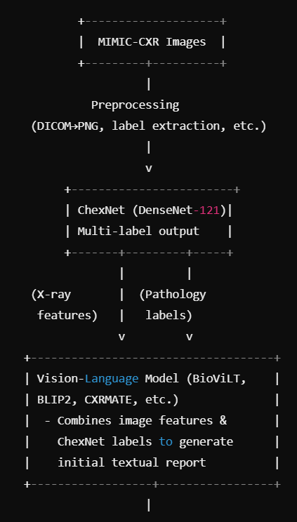
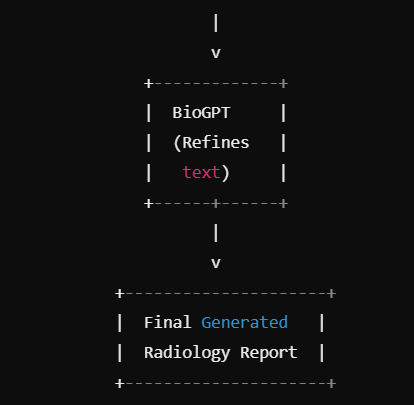

# Proposal

## Problem Statement

Manual chest X-ray reporting requires significant time and is prone to delays under high workloads. An automated system capable of accurately generating preliminary reports can help streamline the diagnostic process and assist radiologists more effectively.

## Dataset Selection
MIMIC-CXR is an extensive dataset comprising 377,110 de-identified chest radiographs linked to 227,835 radiographic studies. All images are provided in DICOM format, accompanied by free-text radiology reports. These data come from the Beth Israel Deaconess Medical Center and are meticulously de-identified following HIPAA Safe Harbor guidelines. Due to its breadth and detail, MIMIC-CXR offers a valuable resource for investigations into automated image interpretation, clinical decision support, and text analysis within the domain of medical imaging and natural language processing (NLP).

In the context of the Data Science Capstone, a subset of this dataset will be employed, contingent on computing resources and time constraints. Access to the dataset requires completion of the PhysioNet Credentialed Health Data License and relevant CITI training, ensuring that sensitive information is responsibly handled.

In the Data Science Capstone, the part of this dataset may be used based on the computing resources or time limit.

**Dataset Link:** [MIMIC-CXR (v2.1.0)](https://physionet.org/content/mimic-cxr/2.1.0/)

## Data Processing

## Proposed Multi-Model Architecture 1
1. **ChexNet for Multi-Label Classification**  
   - Extracts core pathologies (e.g., pneumonia, cardiomegaly) from X-ray images using DenseNet-121.  
   - Offers a structured set of labels to ground subsequent text generation in real clinical findings.

2. **Vision-Language Model**  
   - Options include BioViLT, BLIP2, or CXRMATE.  
   - Fuses the X-ray image features and ChexNet labels, then generates or refines an initial descriptive report.

3. **Biomedical Language Model (BioGPT)**  
   - Receives intermediate text or embeddings, refining the final report’s fluency and coherence.  
   - Integrates domain-specific phrasing and medical knowledge.  

4. **Parameter-Efficient Fine-Tuning (PEFT) and LoRA**  
   - Reduces the number of trainable parameters while maintaining performance.  
   - Allows efficient adaptation of large models with limited computational resources.

## Proposed Multi-Model Architecture 2

First, I feed X-ray images into a specialized pre-trained encoder, such as a CNN or Vision Transformer fine-tuned on chest X-ray data. This step helps extract relevant radiological features from each image, capturing any clinically significant patterns.  

Next, I use a text-generation module, often a Transformer decoder, to take these image embeddings and generate a concise report describing the findings. It can determine whether the scan is normal or identify potential abnormalities like lung opacities. By fine-tuning on medical image-text datasets like MIMIC-CXR, I ensure the generated text follows domain-specific language and improves accuracy.  

Finally, I pass the generated textual findings into a large language model (e.g., GPT through the OpenAI API) to interpret these observations and suggest possible diagnoses or further clinical insights. By separating image analysis from textual reasoning, I leverage specialized vision models for accurate feature extraction while using large language models for robust interpretation, forming a cohesive and efficient end-to-end system.

## Checklist

 - [ ] Dataset Permit
 - [ ] Dataset Downloading
 - [ ] Dataset Preprocessing
 - [ ] Dataset Info Checking
 - [ ] Dataset Pixel Adjusted
 - [ ] Package Version Selection
 - [ ] Model Selection
 - [ ] Model Comparison
 - [ ] Pre-trained Model
 - [ ] Fune Toning Model
 - [ ] Model Evaluation
 - [ ] Connecting to API
 - [ ] Web Design
 - [ ] Web Development
 - [ ] Web Test
 - [ ] Model Evaluation again

## Computational Resources
A **g2.2xlarge** instance on AWS will serve as the primary machine for this project. This instance is expected to provide a balance of GPU capabilities for model training and sufficient storage for data processing.
### Software 

## Metrics

1. Language Quality (NLG Metrics)

- BLEU (preferred)
- ROUGE 

2. Clinical Accuracy 

- CheXpert

3. Image-Text Alignment

- CLIP-based similarity

## Timeline
Below is an eight-week schedule starting from **February 11**:

 - **Week 1 (Feb 11 – Feb 17)**
	 - Acquire permissions (CITI training, license approvals).
	 - Download and validate the MIMIC-CXR data subset.
- **Week 2 (Feb 18 – Feb 24)**
  - Preprocess images and textual data.  
  - Finalize package versions and environment setup.

- **Week 3 (Feb 25 – Mar 3)**  
  - Select preliminary models (CNNs for images, transformer-based or RNNs for text).  
  - Begin model comparison experiments.

- **Week 4 (Mar 4 – Mar 10)**  
  - Evaluate and compare model performance.  
  - Incorporate pre-trained models and refine hyperparameters.

- **Week 5 (Mar 11 – Mar 17)**  
  - Fine-tune selected model(s) on the refined dataset.  
  - Perform thorough validation and error analysis.

- **Week 6 (Mar 18 – Mar 24)**  
  - Integrate model predictions into a simple API or web service.  
  - Begin web interface design and development.

- **Week 7 (Mar 25 – Mar 31)**  
  - Test the web application (including user flow, performance, and security).  
  - Conduct final model evaluations.

- **Week 8 (Apr 1 – Apr 7)**  
  - Finalize documentation, presentations, and any supplementary materials.  
  - Prepare deliverables for project review.